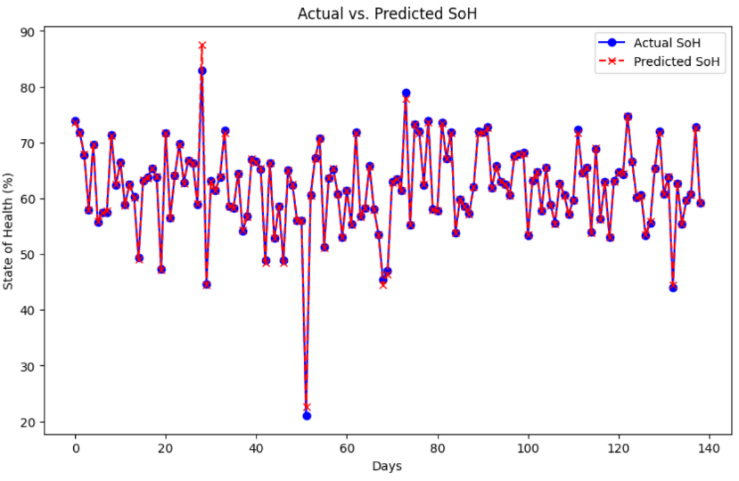
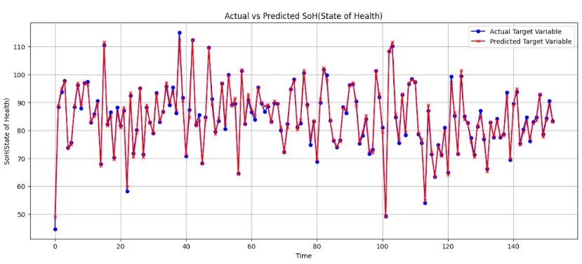
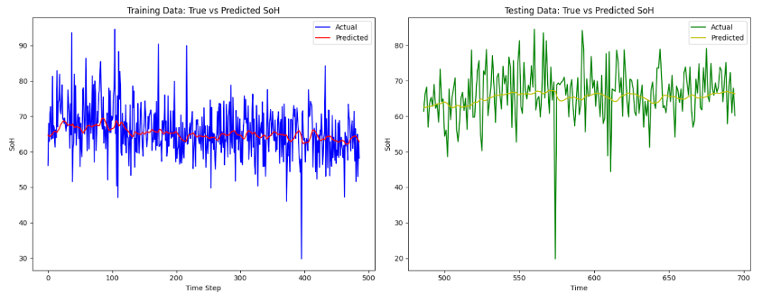

# aisolutions

## Project Overview
This project applies three distinct machine learning algorithms: Long Short-Term Memory (LSTM), Random Forest (RF), and Extreme Gradient Boosting (XGBoost), to predict the State of Health (SoH) of batteries. These models analyze battery data to predict degradation patterns, aiding in maintenance and operational strategies.

## Motivation
The main goal of this project is to enhance battery management systems by providing accurate predictions of battery health. Accurately predicting battery SoH can lead to better maintenance schedules, increased safety, and optimized performance, which are critical in applications ranging from electric vehicles to renewable energy storage.

## Models
### Long Short-Term Memory (LSTM)
- **Description**: LSTM networks are well-suited for sequential data prediction, making them ideal for time-series data like battery charge cycles.
- **Application**: Analyzing sequential discharge and charge cycles to predict SoH.

### Random Forest (RF)
- **Description**: RF is an ensemble of decision trees, typically used for classification and regression, providing robustness through its ensemble approach.
- **Application**: Assessing SoH from various independent battery parameters.

### Extreme Gradient Boosting (XGBoost)
- **Description**: XGBoost is a powerful, efficient, and fast algorithm using gradient boosting frameworks to build decision trees.
- **Application**: Forecasting battery SoH from a combination of time-series and static data.

## Dataset
The data used in this project includes metrics such as voltage, current and temperature. https://github.com/TengMichael/battery-charging-data-of-on-road-electric-vehicles.git is the main source.

## Results
XGBoost
RandomForest
LSTM

| Model       | MAE    | RMSE   | R^2   | F1     | Sensitivity | Specificity | Training Time | Prediction Time | CPU Usage |
|-------------|--------|--------|-------|--------|-------------|-------------|---------------|-----------------|-----------|
| Random Forest | 0.396  | 0.531  | 0.997 | 0.946  | 0.9524      | 0.9524      | 0.00108 sec   | 0.019511 sec    | 88.6%     |
| XGBoost     | 0.1639 | 0.4589 | 0.9965| 0.971  | 1.0000      | 0.7778      | 0.636 sec     | 0.002 sec       | 85.1%     |
| LSTM        | 0.071  | 0.091  | 0.004 | null   | null        | null        | 30.86 sec     | 1.1674 sec      | 68%       |


## Installation
To set up the project environment:

```bash
# Clone the repository
git clone https://github.com/oguzhanherkiloglu/aisolutions.git
cd [Your Repository Directory]

# Install required libraries
pip install -r requirements.txt

